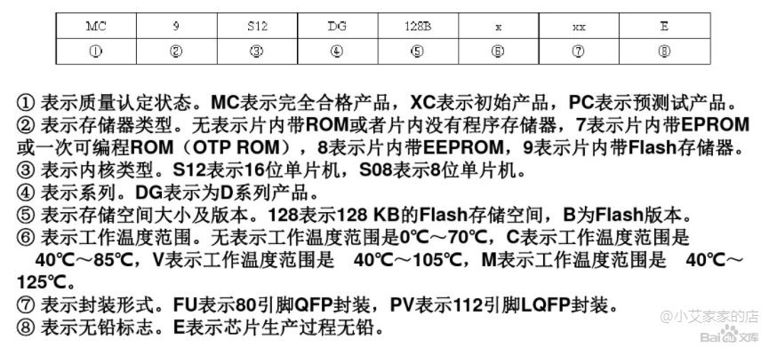

# 单片机汇总

##  1. 类型总结

| 名称         | 位数 | 公司             | 其他 |
| ------------ | ---- | ---------------- | ---- |
| MCS51        | 8    | INTEL            |      |
| 89C51系列    | 8    | ATMEL            |      |
| MSP430       | 16   | TI               |      |
| AVR          | 8    | ATMEL            |      |
| PIC          |      |                  |      |
| MC9S12(图片) | 16   | freescale        |      |
| SDA3546      |      | infineon(英飞凌) |      |

